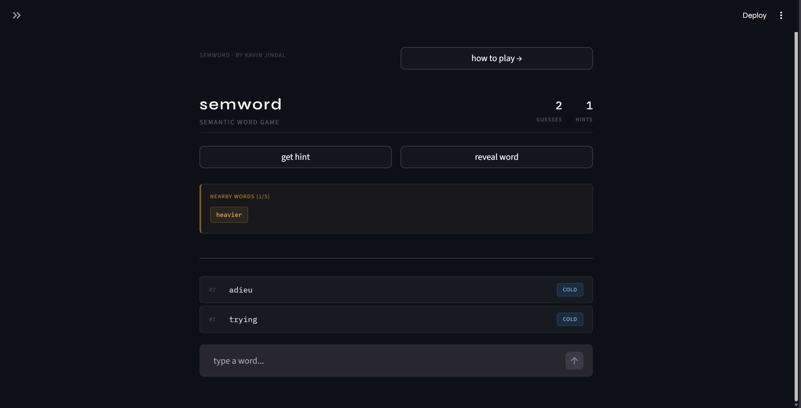
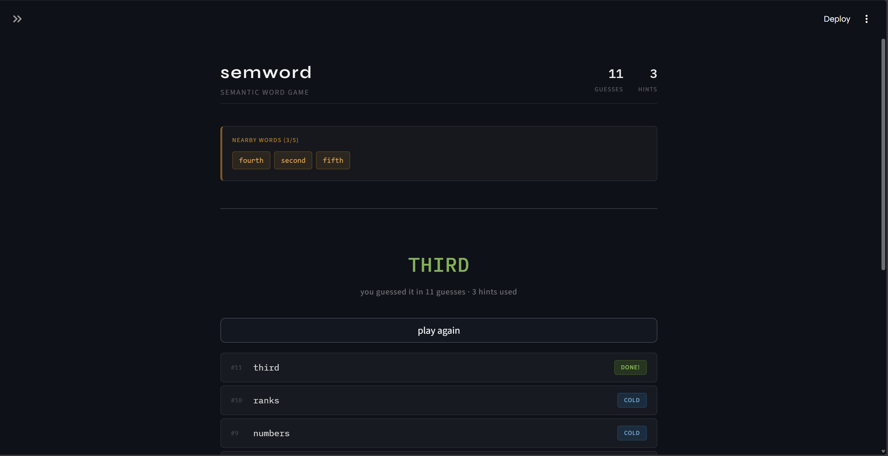
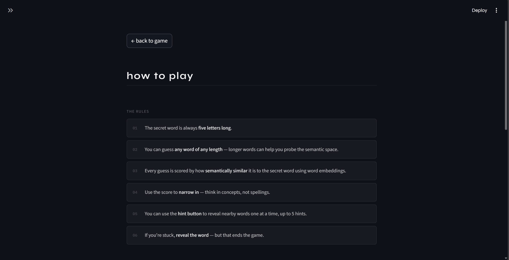

# Semword

A minimal semantic word-guessing game built with **Streamlit**. Challenge yourself to find the secret word by exploring semantic relationships.

## Features

- **Semantic Similarity**: Feedback based on cosine similarity (Cold, Warm, Hot, Very Hot).
- **Intelligent Hints**: Reveal words that are semantically close to the target.
- **Clean Interface**: A distraction-free, typography-focused design
- **Fast Performance**: Powered by pre-computed word embeddings for instant similarity scoring.

## Screenshots

<p align="center">
  
  
  
</p>
<p align="center">
    

</p>
<p align="center">
  
  
  
</p>

## Tech Stack

- **Frontend**: Streamlit
- **Logic**: Python, NumPy, Scikit-learn
- **Data**: Word embeddings (ConceptNet Numberbatch)

## Setup

1. **Clone the repository**:
   ```bash
   git clone https://github.com/kavin-jindal/SemWord.git
   ```

2. **Install dependencies**:
   ```bash
   pip install streamlit numpy scikit-learn
   ```

3. **Run the application**:
   ```bash
   streamlit run app.py
   ```

## Developer's Note

I was experimenting with Vector Embeddings and Pinecone DB a week ago when the idea of building a semantic based Wordle variant struck me. There are already such games available yet I undertook this project solely as a learning experience. Over the week long development cycle, I spent most of my time experimenting with different word embeddings and models starting from HuggingFace's all-MiniLM-L6-v2 to GloVe, Google-News-300, Word2Vec, Cohere's embeddings and finally settling on ConceptNet Numberbatch for its balance of performance and size. I also had to clean the embeddings to remove unecessary words and phrases considering the file was pretty big and would take too much time to load. 

I manually wrote the backend after a lot of experimentation and tinkering and setup a working prototype on Streamlit. After that I used Claude Code to improve the UI because I absolutely hate doing frontend design myself. 

In order to speed up the backend I have dumped all the embeddings in a pickle file. I was using a text file previously and even considered using Pinecone DB at first but I eventually figured out a way to make it work locally. 

I hope you like the project, any contributions to improve the project are welcome.
