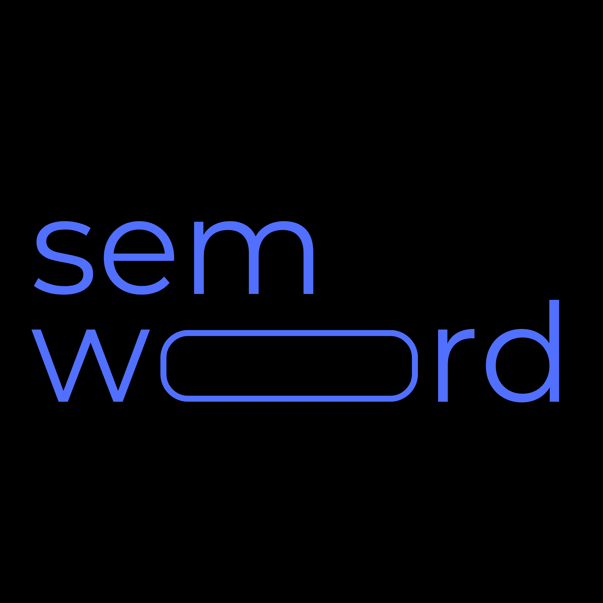

<p>
  
  
</p>

# Semword

A minimal semantic word-guessing game built with **Streamlit**. Challenge yourself to find the secret word by exploring semantic relationships.

[**Play Now →**](https://semword.streamlit.app/)

## Features

- **Semantic Similarity**: Feedback based on cosine similarity scores.
- **Intelligent Hints**: Reveal nearby words to help you narrow down the target.
- **Reveal Word**: Stuck? You can reveal the secret word to see how close you were.
- **Clean Interface**: A distraction-free, typography-focused design.
- **Fast Performance**: Powered by Pinecone vector search for instant similarity scoring.

## Screenshots

<p align="center">
  
  
  
</p>
<p align="center">
    

</p>
<p align="center">
  
  
  
</p>

## Tech Stack

- **Logic**: Python, NumPy, Scikit-learn
- **Database**: Pinecone (Vector database for similarity search)
- **Environment**: Python-dotenv
- **Data**: ConceptNet Numberbatch word embeddings

## Setup

1. **Clone the repository**:
   ```bash
   git clone https://github.com/kavin-jindal/SemWord.git
   ```

2. **Install dependencies**:
   ```bash
   pip install -r requirements.txt
   ```

3.  **Environment Setup**:
    Create a `.env` file in the root directory and add your Pinecone API key:
    ```env
    PINECONE=your_api_key_here
    ```
    *Note: An index named `semword-index` is required in your Pinecone project.*

4. **Run the application**:
   ```bash
   streamlit run app.py
   ```

## Developer's Note

I was experimenting with Vector Embeddings and Pinecone DB a week ago when the idea of building a semantic based Wordle variant struck me. There are already such games available yet I undertook this project solely as a learning experience. Over the week long development cycle, I spent most of my time experimenting with different word embeddings and models starting from HuggingFace's all-MiniLM-L6-v2 to GloVe, Google-News-300, Word2Vec, Cohere's embeddings and finally settling on ConceptNet Numberbatch for its balance of performance and size. I also had to clean the embeddings to remove unecessary words and phrases considering the file was pretty big and would take too much time to load. 

I manually wrote the backend after a lot of experimentation and tinkering and setup a working prototype on Streamlit. After that I used Claude Code to improve the UI because I absolutely hate doing frontend design myself. 

In order to speed up the backend and handle search efficiently, I integrated **Pinecone DB**. This allows for extremely fast similarity scoring and vector search directly in the cloud, removing the need for heavy local embedding files. 

I hope you like the project, any contributions to improve the project are welcome.
